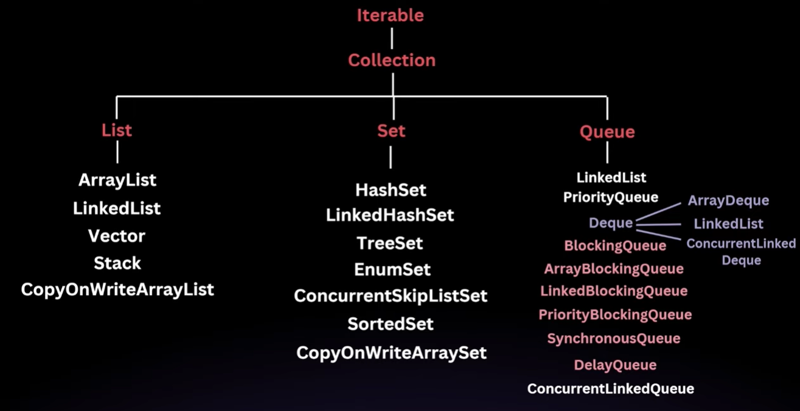

# Introduction to Java Collections

A **collection** is simply a group of elements or objects — such as strings, numbers, or other objects — managed as a single unit.

Before Java **version 1.2**, developers relied on independent classes like `Vector`, `Stack`, `Hashtable`, and `Arrays` to manipulate groups of objects. However, these classes had several drawbacks:

| Drawback | Description |
|---|---|
| **Inconsistency** | Each class had its own unique style of managing data, leading to confusion. |
| **Lack of a Common Interface** | No shared interface meant these classes couldn't work together easily, making it difficult to write generic methods. |

The **Collection Framework** was introduced in **Java 1.2** to solve these issues by providing a unified architecture with common interfaces, enabling interoperability and the use of generic methods and variables.

---

## The Collection Hierarchy

The framework is structured as a hierarchy of interfaces and classes.

### 1. The Root: `Iterable` Interface

The `Iterable` interface is the **absolute root** of the entire collection hierarchy.

- **Purpose:** Its primary role is to allow any class that implements it to be used with a **for-each loop**.
- **Relationship:** Every other collection interface (`List`, `Set`, `Queue`) eventually extends `Iterable`.

### 2. The `Collection` Interface

The `Collection` interface is the **root interface** for most collection types and is part of the `java.util` package. It provides a blueprint for basic operations that all implementation classes must follow.

It is extended by three key sub-interfaces:

| Sub-Interface | Description | Common Implementations |
|---|---|---|
| **`List`** | An ordered collection that **allows duplicate** elements. | `ArrayList`, `LinkedList` |
| **`Set`** | A collection that **does not allow duplicates** and is generally unordered. | `HashSet`, `LinkedHashSet` |
| **`Queue`** | Follows the **FIFO** (First-In-First-Out) principle — like a line at a doctor's office where the first person to arrive is the first to be served. | `PriorityQueue`, `LinkedList` |

### 3. Specialized Queues

- **`Deque` (Double-Ended Queue):** Pronounced as *"deck"* — allows elements to be added or removed from **both ends**.
- **`BlockingQueue`:** A specialized queue designed for specific **concurrency** scenarios.

---

## The `Map` Interface

The `Map` interface **stands separately** from the `Collection` hierarchy.

- **Structure:** Stores data in **key-value pairs** — for example, a student's roll number *(key)* mapped to the student's name *(value)*.
- **Hierarchy:** Under the `Map` interface, there are specialized versions like `HashMap`, `SortedMap`, and `ConcurrentMap`.

---

## Collection Hierarchy Overview

```
Iterable
└── Collection
    ├── List
    │   ├── ArrayList
    │   └── LinkedList
    ├── Set
    │   ├── HashSet
    │   └── LinkedHashSet
    └── Queue
        ├── PriorityQueue
        └── Deque
            └── ArrayDeque

Map (separate hierarchy)
├── HashMap
├── SortedMap
│   └── TreeMap
└── ConcurrentMap
```



---

## Summary of Key Implementation Classes

| Interface | Common Implementation Classes |
|---|---|
| `List` | `ArrayList`, `LinkedList` |
| `Set` | `HashSet`, `LinkedHashSet` |
| `Queue` | `PriorityQueue`, `LinkedList` |
| `Map` | `HashMap`, `TreeMap` |

> 💡 The Collection Framework ensures that while the **interfaces** provide the blueprint and logic, the **classes** provide the actual implementation for managing data efficiently.