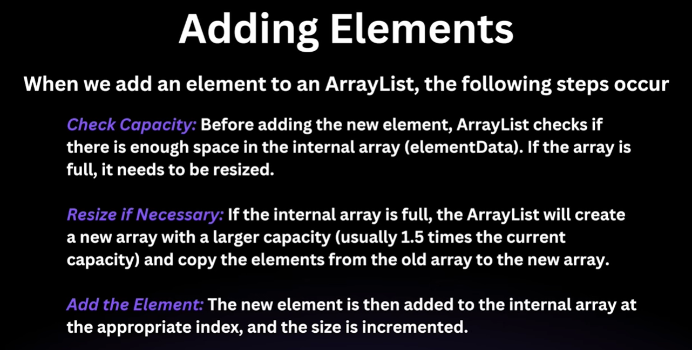
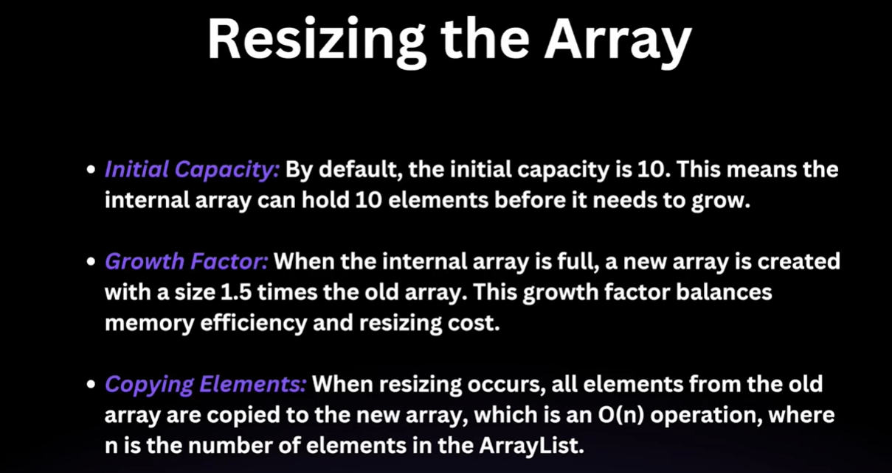
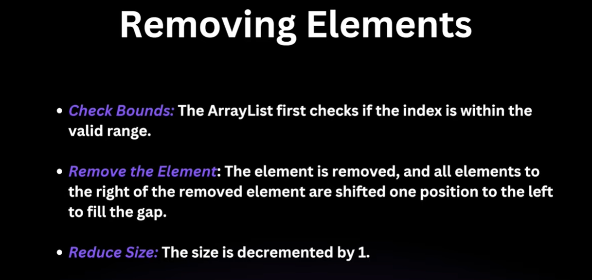

# ArrayList in Java

---

## 1. The `List` Interface — Overview

The `List` interface is part of the `java.util` package and extends the `Collection` interface. It provides the blueprint for core methods like `size()`, `isEmpty()`, `contains()`, `add()`, and `remove()`.

### Key Characteristics

| Characteristic | Description |
|---|---|
| **Ordered** | Maintains the insertion order of elements. |
| **Duplicates Allowed** | The same element can appear multiple times. |
| **Index-Based** | Elements can be accessed directly using their index, similar to arrays. |

### Common Implementations

`ArrayList` · `LinkedList` · `Vector` · `Stack`

---

## 2. Introduction to `ArrayList`

- **Dynamic Nature:** Unlike regular arrays which have a fixed size, `ArrayList` is a **dynamic data structure** — it grows or shrinks automatically as elements are added or removed.
- **Generics:** It is a parameterized (generic) class, so you can define the type of data it stores (e.g., `ArrayList<Integer>`) to ensure **type safety**.

### ✅ Best Practice

Always use the `List` interface as the reference type:

```java
// Preferred
List<Integer> list = new ArrayList<>();

// Avoid
ArrayList<Integer> list = new ArrayList<>();
```

> 💡 Programming to an interface (`List`) rather than the implementation (`ArrayList`) makes it easier to swap implementations later without changing other code.

---

## 3. Basic Operations & Methods

### ➕ Adding Elements

```java
List<String> list = new ArrayList<>();

list.add("Apple");               // Appends to end → [Apple]
list.add("Banana");              // Appends to end → [Apple, Banana]
list.add(1, "Mango");            // Inserts at index 1 → [Apple, Mango, Banana]

List<String> more = List.of("Grapes", "Cherry");
list.addAll(more);               // Adds all → [Apple, Mango, Banana, Grapes, Cherry]
```

| Method | Description |
|---|---|
| `add(element)` | Appends element to the end. |
| `add(index, element)` | Inserts at index; shifts subsequent elements right. |
| `addAll(collection)` | Appends all elements from another collection. |

---

### 🔍 Accessing & Modifying Elements

```java
String item = list.get(0);        // → "Apple"
list.set(0, "Pineapple");         // Replaces index 0 → [Pineapple, Mango, ...]
```

| Method | Description |
|---|---|
| `get(index)` | Returns the element at the given index. |
| `set(index, element)` | Replaces element at index. Does **not** shift other elements. |

---

### ➖ Removing Elements

```java
list.remove(0);              // Removes element at index 0
list.remove("Banana");       // Removes first occurrence of "Banana"
```

| Method | Description |
|---|---|
| `remove(index)` | Removes the element at the specified index. |
| `remove(Object)` | Removes the **first occurrence** of the specified object. |

> ⚠️ **Watch out:** For `ArrayList<Integer>`, calling `remove(2)` removes by **index**, not by value. To remove by value, use `remove(Integer.valueOf(2))`.

---

### 🛠️ Utility Methods

```java
list.size();              // Number of elements
list.contains("Mango");   // true/false
list.isEmpty();           // true if no elements
```

---

## 4. Internal Working of `ArrayList`

Internally, `ArrayList` uses an **array of `Object`s** to store data.

### Resizing Mechanism





```
Initial State:  [ _, _, _, _, _, _, _, _, _, _ ]  ← capacity = 10, size = 0

After 10 adds:  [ A, B, C, D, E, F, G, H, I, J ]  ← capacity = 10, size = 10

On 11th add:    New array created (capacity = 10 × 1.5 = 15)
                Old elements copied → New element added
                [ A, B, C, D, E, F, G, H, I, J, K, _, _, _, _ ]
```

| Term | Meaning |
|---|---|
| **Size** | Number of elements **actually present** in the list. |
| **Capacity** | Total size of the **internal array** (allocated memory). |

```java
private static final int DEFAULT_CAPACITY = 10; // present inside ArrayList class
transient Object[] elementData; // This is the array where ArrayList stores data
```

### Key Capacity Details

- **Default initial capacity:** `10`
- **Growth factor:** `1.5×` the current capacity when the array is full.
- **Memory optimization:** Use `trimToSize()` to shrink the internal array down to the current size.

```java
ArrayList<Integer> list = new ArrayList<>();  // capacity = 10
// ... add 10 elements ...
// Adding 11th element triggers resize → capacity becomes 15

list.trimToSize();  // Shrinks internal array to match current size
```

---

## 5. Alternative Ways to Create Lists

```java
// 1. Arrays.asList() — Fixed-size list
List<String> list1 = Arrays.asList("A", "B", "C");
list1.set(0, "X");    // ✅ Allowed — can replace
list1.add("D");       // ❌ UnsupportedOperationException — cannot add/remove

// 2. List.of() — Immutable list (Java 9+)
List<String> list2 = List.of("A", "B", "C");
list2.set(0, "X");    // ❌ UnsupportedOperationException
list2.add("D");       // ❌ UnsupportedOperationException

// 3. Converting List → Array
Integer[] arr = list.toArray(new Integer[0]);
```

| Method | Add/Remove | Replace (`set`) | Mutable? |
|---|---|---|---|
| `new ArrayList<>()` | ✅ | ✅ | ✅ Fully mutable |
| `Arrays.asList()` | ❌ | ✅ | ⚠️ Partially mutable |
| `List.of()` | ❌ | ❌ | ❌ Immutable |

---

## 6. Performance — Time Complexity

| Operation | Time Complexity | Reason |
|---|---|---|
| `get(index)` | **O(1)** | Direct index access on internal array. |
| `add(element)` (at end) | **O(1)** amortized | Fast unless resizing is triggered. |
| `add(index, element)` | **O(n)** | Elements to the right must be shifted. |
| `remove(index)` | **O(n)** | Elements to the right must be shifted left. |
| `contains(element)` | **O(n)** | Linear scan of all elements. |
| Iteration | **O(n)** | Every element must be visited. |

> 💡 `ArrayList` is best suited for **frequent reads** (`get`). If you frequently insert or remove elements in the **middle**, consider `LinkedList` instead.

---

## 7. Sorting

```java
List<Integer> numbers = new ArrayList<>(Arrays.asList(5, 3, 8, 1, 2));

// Option 1 — Collections utility class
Collections.sort(numbers);       // → [1, 2, 3, 5, 8]

// Option 2 — List's own sort method
numbers.sort(null);              // null uses natural ordering → [1, 2, 3, 5, 8]

// Option 3 — Reverse order using Comparator
numbers.sort(Comparator.reverseOrder());  // → [8, 5, 3, 2, 1]
```

---

## Quick Reference Summary

```
ArrayList
├── Backed by: Object[]
├── Default capacity: 10
├── Growth factor: 1.5x
├── Allows duplicates: Yes
├── Maintains insertion order: Yes
├── Thread-safe: No (use Vector or Collections.synchronizedList() if needed)
└── Best for: Random access (read-heavy operations)
```